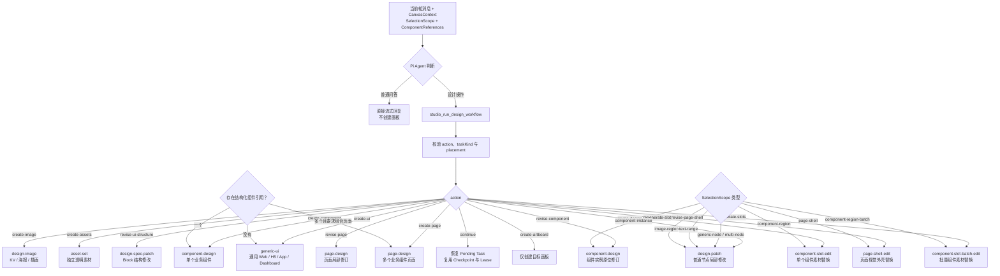
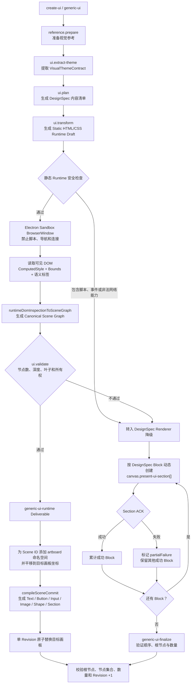
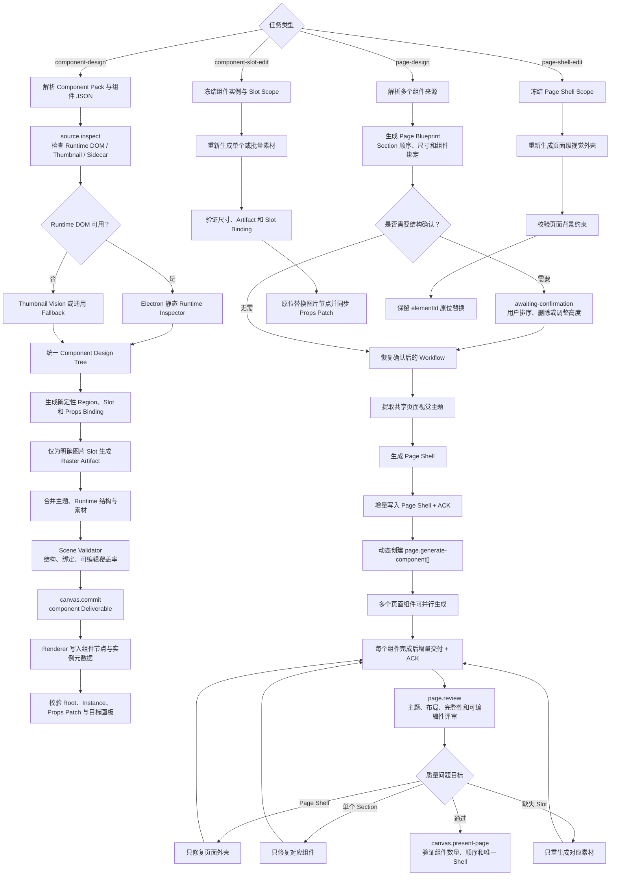
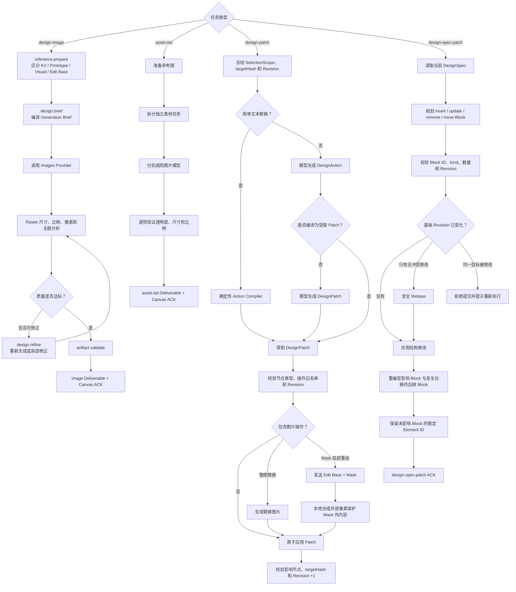
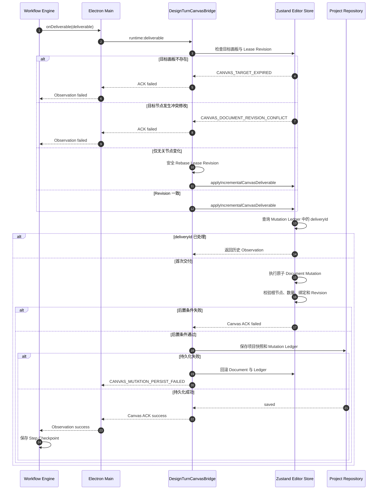
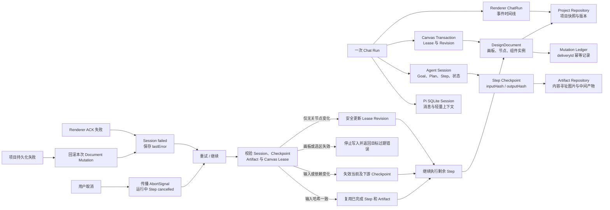

# 项目流程图

> 基于当前 `React Renderer + Electron IPC + Pi Agent Runtime + Workflow Graph + Canvas Transaction` 实现整理。
> 本文用于快速理解从用户输入、模型决策、设计生成到画布提交、持久化和恢复的完整链路。

## 1. 系统端到端主流程

```mermaid
flowchart TD
    User["用户输入<br/>自然语言 / 图片 / @组件 / 选区"] --> Composer["PromptComposer / Lexical<br/>整理文本、Mention、附件"]
    Composer --> ChatPanel["ChatPanel<br/>创建消息与 ChatRun"]
    ChatPanel --> Controller["executeDesignChatTurn<br/>统一设计回合控制器"]

    Controller --> Context["构造 RuntimeContext<br/>项目、画板、选区、组件引用<br/>模型、Skill、Style Pack"]
    Context --> API["applyChatEdit"]
    API --> Preload["Electron Preload Bridge"]
    Preload --> IPC["runtime:startStream IPC"]

    subgraph Main["Electron 主进程"]
        IPC --> MainHandler["main.mjs<br/>注册 Stream 与 ACK 通道"]
        MainHandler --> Request["startRuntimeStream"]
        Request --> TypeCheck{"请求类型"}

        TypeCheck -->|agent_run| PiRuntime["Pi Agent Runtime"]
        TypeCheck -->|结构化文本任务| TextProvider["Pi Text Model"]
        TypeCheck -->|生成图片| ImageProvider["Pi Images Provider"]

        PiRuntime --> Assemble["组装 Agent 上下文<br/>当前消息、历史摘要、CanvasContext<br/>Skill Catalog、组件引用"]
        Assemble --> AgentLoop["pi-agent-core Agent Loop"]
        AgentLoop --> AgentDecision{"模型决策"}

        AgentDecision -->|普通问答| Reply["流式聊天回复"]
        AgentDecision -->|需要 Skill| Skill["skill_activate<br/>skill_read_resource"]
        Skill --> AgentLoop

        AgentDecision -->|设计或修改| WorkflowTool["studio_run_design_workflow"]
        WorkflowTool --> DecisionCheck["校验 WorkflowDecision<br/>action / taskKind / placement<br/>surface / output / references"]
        DecisionCheck --> TargetRequest["CanvasTargetRequest<br/>目标画板、操作类型、基础 Revision"]
    end

    TargetRequest -->|IPC Event| CanvasResolver["resolveWorkflowCanvasTarget<br/>Renderer 确定性解析目标"]
    CanvasResolver --> TargetChoice{"Placement"}

    TargetChoice -->|create| NewBoard["新建或复用空白画板"]
    TargetChoice -->|insert| ExistingBoard["追加到指定画板"]
    TargetChoice -->|revise| SelectionBoard["使用选区所属画板"]
    TargetChoice -->|variant| VariantBoard["复制旧画板生成新版本"]
    TargetChoice -->|assets| AssetBoard["创建或复用素材画板"]
    TargetChoice -->|resume| ResumeBoard["验证并复用上次 Lease"]

    NewBoard --> Lease["CanvasTargetLease<br/>artboardId / documentRevision<br/>leaseId / transactionId"]
    ExistingBoard --> Lease
    SelectionBoard --> Lease
    VariantBoard --> Lease
    AssetBoard --> Lease
    ResumeBoard --> Lease

    Lease -->|CanvasTargetAck| Workflow["Design Workflow Engine"]
    Workflow --> Session["加载 Agent Session<br/>恢复 Plan 与 Checkpoint"]
    Session --> Plan["按 taskKind 创建确定性 Plan"]
    Plan --> Ready["Workflow Graph<br/>选择 Ready Step"]
    Ready --> Budget["检查 Turn Budget<br/>迭代、模型、生图预算"]
    Budget --> Tool["执行领域 Tool"]
    Tool --> ToolResult{"执行结果"}

    ToolResult -->|成功| Checkpoint["保存 Observation<br/>Artifact 与 Step Checkpoint"]
    Checkpoint --> Dynamic{"是否产生动态步骤"}
    Dynamic -->|是| Extend["插入页面组件、Repair<br/>或分段交付步骤"]
    Extend --> Ready
    Dynamic -->|否| Deliverable{"是否产生画布交付物"}
    Deliverable -->|否| More{"还有未完成 Step"}
    More -->|是| Ready

    Deliverable -->|是| Deliver["Canvas Deliverable<br/>图片 / Scene / Patch / 组件 / 页面"]
    Deliver -->|IPC Event| CanvasBridge["DesignTurnCanvasBridge"]
    CanvasBridge --> LeaseCheck{"目标与 Lease 校验"}

    LeaseCheck -->|画板不存在| Expired["CANVAS_TARGET_EXPIRED"]
    LeaseCheck -->|目标节点有并发修改| Conflict["CANVAS_DOCUMENT_REVISION_CONFLICT"]
    LeaseCheck -->|可安全重基| Rebase["更新 Lease Revision"]
    LeaseCheck -->|版本一致| Apply["applyIncrementalCanvasDeliverable"]
    Rebase --> Apply

    Apply --> Idempotent{"deliveryId 已处理？"}
    Idempotent -->|是| CachedAck["返回历史 Observation<br/>忽略重复交付"]
    Idempotent -->|否| Mutation["原子修改 Zustand DesignDocument"]
    Mutation --> PostCheck["后置条件校验<br/>目标、根节点、数量、Revision"]
    PostCheck -->|失败| WriteFail["Canvas ACK Failed"]
    PostCheck -->|成功| Persist["保存项目快照<br/>记录 Mutation Ledger"]

    Persist --> PersistResult{"持久化成功？"}
    PersistResult -->|否| Rollback["回滚 Document 与 Ledger"]
    Rollback --> WriteFail
    PersistResult -->|是| Ack["Canvas ACK Success"]
    CachedAck --> Ack

    Ack -->|IPC| Checkpoint
    More -->|否| Complete["Session 与 Canvas Transaction<br/>标记 completed / committed"]
    Complete --> FinalReply["生成用户可见结果<br/>更新 Run Timeline"]
    Reply --> FinalReply

    ToolResult -->|可重试错误| Retry{"attempt 小于 2？"}
    Retry -->|是| Ready
    Retry -->|否| Failed["保存失败 Session 与错误事件"]
    ToolResult -->|暂停确认| Waiting["awaiting-confirmation<br/>保存 Pending Task"]
    Waiting --> User
    ToolResult -->|用户取消| Cancelled["AbortController<br/>任务标记 cancelled"]

    Expired --> Failed
    Conflict --> Failed
    WriteFail --> Failed
    Failed --> FinalReply
    Cancelled --> FinalReply
    FinalReply --> UI["聊天正文、执行时间线<br/>画布结果与可行动错误"]
```

## 2. 高层意图与任务分流

## 3. 通用 UI 工作流

## 4. 业务组件与完整页面工作流

## 5. 图片、素材与局部修改工作流

## 6. Canvas Deliverable 事务

## 7. 状态、恢复与持久化闭环

## 8. 主要代码入口映射

| 流程区域                         | 主要实现                                                                                              |
| -------------------------------- | ----------------------------------------------------------------------------------------------------- |
| 页面路由与编辑器外壳             | `src/app/router.tsx`、`src/pages/EditorPage.tsx`                                                      |
| 聊天回合控制                     | `src/features/ai/design-chat-controller.ts`、`agent-chat-run-controller.ts`                           |
| Renderer 与 Electron 通信        | `src/features/ai/api.ts`、`electron/preload.mjs`、`electron/main.mjs`                                 |
| Pi Agent 与高层工具              | `electron/runtime/pi/agent-runtime.mjs`、`electron/runtime/request.mjs`                               |
| 意图与确定性计划                 | `electron/runtime/intent-router.mjs`、`agent-planner.mjs`                                             |
| Workflow Graph 与执行循环        | `electron/runtime/workflow-graph.mjs`、`electron/runtime/agent.mjs`                                   |
| 领域工具实现                     | `electron/runtime/agent-tools.mjs`                                                                    |
| Runtime Plugin 与 Source Adapter | `electron/runtime/plugins/`                                                                           |
| Canvas Target 与事务桥接         | `src/features/editor/utils/workflow-canvas-target.ts`、`src/features/ai/design-turn-canvas-bridge.ts` |
| 增量交付与 ACK                   | `src/features/editor/utils/incremental-delivery.ts`                                                   |
| Scene Graph 与原子提交           | `src/features/editor/scene/`                                                                          |
| 编辑器状态与文档事务             | `src/features/editor/store/editor-store.ts`                                                           |
| 项目、Session 与 Artifact 持久化 | `electron/projects/`、`electron/runtime/agent-session-store.mjs`、`electron/artifacts/`               |

## 9. 核心不变量

1. Pi Agent 是在线高层设计意图的唯一来源，Renderer 不重复判断聊天或设计任务。
2. 模型只能从 `CanvasContext` 提供的候选目标中选择，不能生成任意画板或节点 ID。
3. 所有设计结果必须通过 Canvas Deliverable 写入真实画布，并收到 Renderer ACK。
4. 未通过目标、Revision、节点集合和后置条件校验的交付不能标记完成。
5. `deliveryId` 与 Mutation Ledger 保证重复交付幂等。
6. Checkpoint 只有在输入哈希和依赖输出仍一致时才能复用。
7. Renderer 不读取 API Key；Provider 凭证只存在于 Electron 主进程。
8. 图片 Base64 不写入 Agent 消息或 Tool Observation，生成结果转为 Artifact 保存。
9. 项目持久化失败时回滚对应画布变更，避免内存状态与磁盘状态分叉。
10. 取消、失败和部分成功必须保留已确认的 Artifact、画布节点与可恢复上下文。
